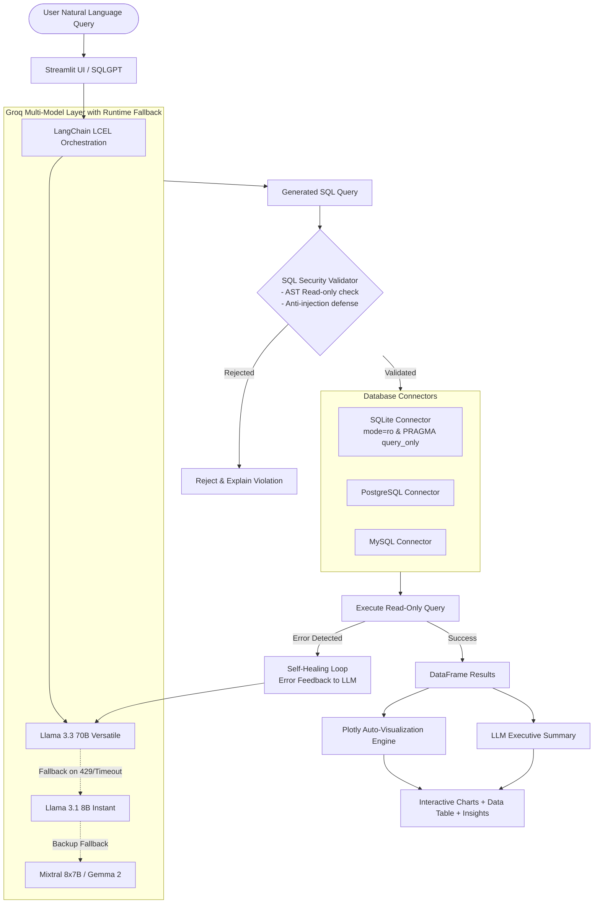

# 🤖 SQLGPT — Natural Language SQL Assistant

[](https://streamlit.io/)
[](https://python.org/)
[](https://langchain.com/)
[](https://groq.com/)
[](https://plotly.com/)

> **Chat with your relational databases in plain English with instant SQL generation, self-healing execution, and automated visualizations.**

**SQLGPT** is an intelligent natural language SQL assistant built with **Generative AI**, **Groq**, **LangChain**, and **Python**. It translates natural-language queries into optimized read-only SQL, executes them safely, and automatically generates interactive **Plotly** charts and executive insights.

---

## 🌟 Highlights & Key Features

- **💬 Natural Language to SQL & Insights**: Converts free-form business questions into valid SQL queries, executing them against connected databases and synthesizing plain-English answers.
- **⚡ Groq Multi-Model Cascading Fallback**: Integrates `Llama 3.3 70B`, `Llama 3.1 8B`, `Mixtral 8x7B`, and `Gemma 2` with dynamic runtime fallback using LangChain LCEL (`with_fallbacks`) for maximum uptime and resilience against rate limits.
- **🔄 LangChain Self-Healing Pipeline**: Automatically detects syntax or execution errors, feeds error feedback back into the LLM, and self-corrects failing queries on the fly.
- **🔒 Multi-Layer Read-Only & AST Injection Protection**: 
  - Connection-level read-only mode (`mode=ro`, `PRAGMA query_only = ON`).
  - AST-level validation using `sqlparse` supporting Common Table Expressions (`WITH ... SELECT`) while blocking DDL/DML mutations (`DROP`, `DELETE`, `UPDATE`, `INSERT`, `ALTER`, `TRUNCATE`, `PRAGMA`, etc.) and stacked query attacks.
- **📊 AI-Powered Data Visualizations**: Automatically detects visual intent and generates interactive Plotly charts (Bar, Line, Pie, Scatter, Histogram, Area, Box) with real-time UI customization.
- **🗄️ Extensible Database Layer**: Pluggable connector architecture with built-in support for SQLite (sample enterprise database and file uploads) and ready-to-use adapters for PostgreSQL and MySQL.

---

## 🏗️ Architecture Overview



---

## 🚀 Quick Start

### 1. Prerequisites
- Python 3.8+
- Groq API Key ([Get a free key here](https://console.groq.com/))

### 2. Installation

```bash
# Clone the repository
git clone https://github.com/ayankhanjoiya/sql-gpt.git
cd sql-gpt

# Create and activate a virtual environment
python -m venv venv
# On Windows:
venv\Scripts\activate
# On macOS/Linux:
source venv/bin/activate

# Install dependencies
pip install -r requirements.txt
```

### 3. Environment Configuration (Optional)

Create a `.env` file in the root directory:
```env
GROQ_API_KEY=your_groq_api_key_here
```

### 4. Run the Application

```bash
streamlit run app.py
```
Open your browser at `http://localhost:8501`.

---

## 📁 Project Structure

```
sql-gpt/
├── src/
│   ├── db/
│   │   ├── __init__.py          # Database module exports
│   │   ├── base.py              # Abstract BaseDatabaseConnector interface
│   │   ├── sqlite.py            # SQLite connector with read-only PRAGMAs
│   │   ├── postgres.py          # Extensible PostgreSQL connector
│   │   ├── mysql.py             # Extensible MySQL connector
│   │   └── security.py          # AST SQL Security & injection validator
│   ├── llm/
│   │   ├── __init__.py          # LLM module exports
│   │   ├── models.py            # Groq model registry & LCEL fallback chains
│   │   ├── sql_chain.py         # LangChain SQL generator & self-healing engine
│   │   └── viz_engine.py        # Automated Plotly visualization engine
│   └── ui/
│       ├── __init__.py          # UI module exports
│       ├── components.py        # Reusable Streamlit components & cards
│       └── styles.py            # Custom CSS and dark theme system
├── create_sample_db.py          # Enterprise sample database generator
├── extended_sample_data.db      # Sample SQLite database
├── app.py                       # Main application entry point
├── streamlit_app.py             # Streamlit Cloud entry point
├── requirements.txt             # Production dependencies
└── README.md                    # Project documentation
```

---

## 💡 Example Queries to Try

- 📊 **Visual Queries:**
  - *"Show a bar chart of product inventory grouped by category"*
  - *"Plot monthly revenue trend over time as a line chart"*
  - *"Create a pie chart showing order distribution across countries"*
- 📈 **Analytical Queries:**
  - *"Who are the top 5 customers by total order spend?"*
  - *"What is the average employee salary by department?"*
  - *"Which products have stock levels below 50 units?"*

---

## 🗄️ Supported Databases

| Database | Support Status | Read-Only Enforcement |
| :--- | :---: | :--- |
| **SQLite** | ✅ Native | `mode=ro` URI + `PRAGMA query_only = ON` |
| **PostgreSQL** | ✅ Native | Read-only transactions + AST validation |
| **MySQL** | ✅ Native | AST validation + dialect support |
| **DuckDB / Snowflake** | 🔄 Extensible | Pluggable via `BaseDatabaseConnector` |

---

## 👨‍💻 Author

Developed with ❤️ by **[Ayan Khan](https://github.com/ayankhanjoiya)**

---

## 📄 License

This project is licensed under the MIT License.
